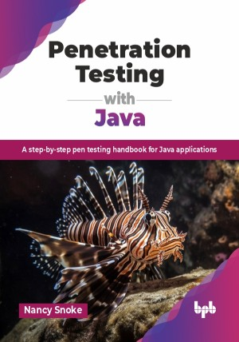

# Penetration Testing with Java

A step-by-step pen testing handbook for Java applications.

This is the repository for [Penetration Testing with Java
](https://bpbonline.com/products/penetration-testing-with-java?variant=44343461380296),published by BPB Publications.

## About the Book
The book provides a comprehensive exploration of Java security and penetration testing, starting with foundational topics such as secure coding practices and the OWASP Top 10 for web applications. The early chapters introduce penetration testing methodologies, including Java web application-specific mapping and reconnaissance techniques. The gathering of information through OSINT and advanced search techniques is highlighted, laying the crucial groundwork for testing. Proxy tools like Burp Suite and OWASP Zap are shown, offering insights into their configurations and capabilities for web application testing.

Each chapter does a deep dive into specific vulnerabilities and attack vectors associated with Java web and mobile applications. Key topics include SQL injection, cross-site scripting (XSS), authentication flaws, and session management issues. Each chapter supplies background information, testing examples, and practical secure coding advice to prevent these vulnerabilities. There is a distinct focus on hands-on testing methodologies, which prepares readers for real-world security challenges.

By the end of this book, you will be a confident Java security champion. You will understand how to exploit vulnerabilities to mimic real-world attacks, enabling you to proactively patch weaknesses before malicious actors can exploit them.

## What You Will Learn
• Study the OWASP Top 10 and penetration testing methods.

• Gain secure coding and testing techniques for vulnerabilities like XSS and CORS.

• Find out about authentication, cookie management, and secure session practices.

• Master access control and authorization testing, including IDOR and privilege escalation.

• Discover Android app security and tools for SAST, DAST, and exploitation.
